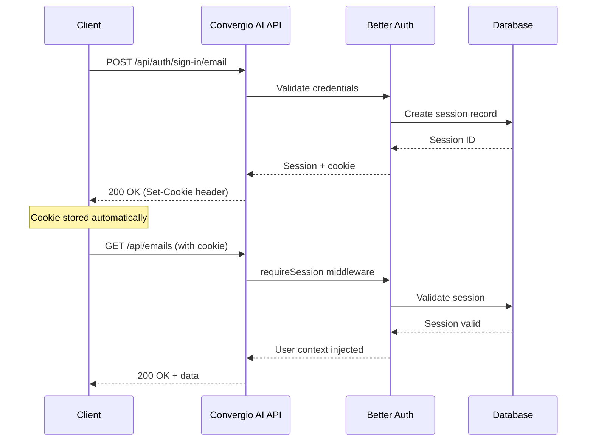

# Authentication

Convergio AI uses [Better Auth](https://www.better-auth.com/) for session-based authentication. All API routes under `/api/*` are protected by the `requireSession` middleware.

!!! info "Key change in v3.0"
    Convergio AI has migrated from JWT-based authentication to **cookie-based sessions** powered by Better Auth. There are no bearer tokens or refresh tokens. Authentication state is managed through secure HTTP-only cookies.

## Authentication flow



## Endpoints

### Sign up

```
POST /api/auth/sign-up/email
```

Create a new user account. An **organization** is automatically created for the user upon registration.

=== "Request"

    ```json
    {
      "email": "user@example.com",
      "password": "securepassword",
      "name": "John Doe"
    }
    ```

=== "Response (200)"

    ```json
    {
      "user": {
        "id": "usr_abc123",
        "email": "user@example.com",
        "name": "John Doe",
        "createdAt": "2026-03-01T12:00:00Z"
      },
      "session": {
        "id": "ses_xyz789",
        "expiresAt": "2026-03-08T12:00:00Z"
      }
    }
    ```

    The response includes a `Set-Cookie` header with a secure, HTTP-only session cookie.

=== "cURL"

    ```bash
    curl -X POST http://localhost:3001/api/auth/sign-up/email \
      -H "Content-Type: application/json" \
      -c cookies.txt \
      -d '{"email": "user@example.com", "password": "securepassword", "name": "John Doe"}'
    ```

=== "JavaScript"

    ```javascript
    const response = await fetch("http://localhost:3001/api/auth/sign-up/email", {
      method: "POST",
      headers: { "Content-Type": "application/json" },
      credentials: "include",
      body: JSON.stringify({
        email: "user@example.com",
        password: "securepassword",
        name: "John Doe",
      }),
    });
    const data = await response.json();
    ```

### Sign in

```
POST /api/auth/sign-in/email
```

Authenticate with email and password. Returns a session cookie.

=== "Request"

    ```json
    {
      "email": "user@example.com",
      "password": "securepassword"
    }
    ```

=== "Response (200)"

    ```json
    {
      "user": {
        "id": "usr_abc123",
        "email": "user@example.com",
        "name": "John Doe"
      },
      "session": {
        "id": "ses_xyz789",
        "expiresAt": "2026-03-08T12:00:00Z"
      }
    }
    ```

=== "cURL"

    ```bash
    curl -X POST http://localhost:3001/api/auth/sign-in/email \
      -H "Content-Type: application/json" \
      -c cookies.txt \
      -d '{"email": "user@example.com", "password": "securepassword"}'
    ```

### Get session

```
GET /api/auth/get-session
```

Retrieve the current authenticated session and user details.

=== "Response (200)"

    ```json
    {
      "user": {
        "id": "usr_abc123",
        "email": "user@example.com",
        "name": "John Doe"
      },
      "session": {
        "id": "ses_xyz789",
        "expiresAt": "2026-03-08T12:00:00Z"
      }
    }
    ```

=== "Response (401)"

    ```json
    {
      "error": "Not authenticated"
    }
    ```

### Sign out

```
POST /api/auth/sign-out
```

Destroy the current session and clear the session cookie.

## Google OAuth

Convergio AI supports Google OAuth for single sign-on:

```
GET /api/auth/sign-in/social?provider=google
```

The OAuth flow redirects through Google's consent screen. After authorization, a session cookie is set and the user is redirected to the application.

## Using authentication

All authenticated requests must include the session cookie:

=== "JavaScript (fetch)"

    ```javascript
    const response = await fetch("http://localhost:3001/api/emails", {
      credentials: "include",
    });
    ```

=== "cURL"

    ```bash
    # Save cookies on login
    curl -X POST http://localhost:3001/api/auth/sign-in/email \
      -H "Content-Type: application/json" \
      -c cookies.txt \
      -d '{"email": "user@example.com", "password": "securepassword"}'

    # Use cookies for subsequent requests
    curl http://localhost:3001/api/emails -b cookies.txt
    ```

=== "Python"

    ```python
    import requests

    session = requests.Session()
    session.post("http://localhost:3001/api/auth/sign-in/email", json={
        "email": "user@example.com",
        "password": "securepassword",
    })

    # Session cookies are stored automatically
    emails = session.get("http://localhost:3001/api/emails")
    ```

## Security model

| Feature | Details |
| ------- | ------- |
| **Session storage** | Database-backed sessions with configurable expiration |
| **Cookie security** | `HttpOnly`, `Secure`, `SameSite=Lax` |
| **Password hashing** | bcrypt with configurable cost factor |
| **Session revocation** | Instant — deleting the session record invalidates access |
| **OAuth providers** | Google (additional providers configurable) |
| **Organizations** | Auto-created on signup with member/invitation management |
