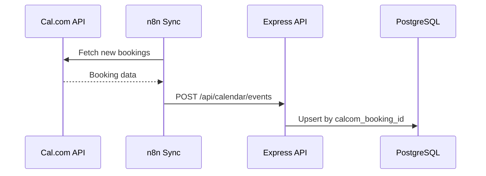

# Calendar & Scheduling

Convergio AI includes a full-featured calendar with multiple view modes, Cal.com integration for booking management, and AI-powered meeting detection from email content.

## Calendar views

| View | Description |
| ---- | ----------- |
| **Month** | Traditional month grid with event dots |
| **Week** | 7-day view with time slots |
| **Day** | Detailed single-day schedule |
| **List** | Chronological event list |

## Event sources

Events can come from three sources:

| Source | How it works |
| ------ | ------------ |
| **Manual** | Created directly in the calendar UI |
| **Cal.com** | Synced from Cal.com bookings via API |
| **Email detected** | AI detects meeting references in emails and suggests events |

## Cal.com integration

Connect your Cal.com account to automatically sync bookings:

1. Go to **Settings** → enter your Cal.com API key
2. Enable sync — bookings are pulled periodically
3. New bookings appear as calendar events with `source: calcom`
4. Event types from Cal.com are available in the dashboard

### Sync process

## AI meeting detection

The meeting detector service analyzes email text using NLP-based keyword scoring:

- Detects date/time references
- Identifies meeting-related language
- Assigns a confidence score
- Suggests creating a calendar event

Use the `/api/calendar/detect` endpoint to analyze any text for meeting signals, or `/api/calendar/events/from-email` to create an event directly from a detected meeting.
