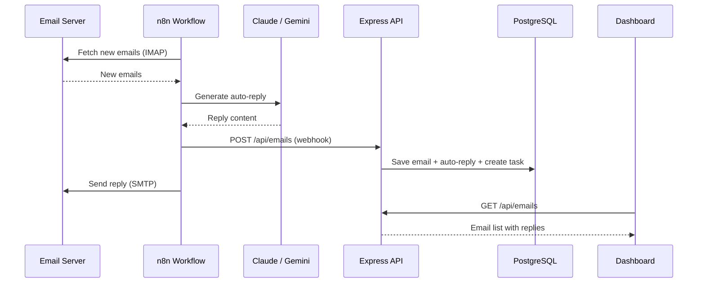

# AI Email Automation (CommBoost)

CommBoost is Convergio AI's intelligent email management system. It connects to multiple IMAP inboxes, automatically categorizes incoming emails, generates AI-powered responses, and syncs everything through n8n workflows.

## How it works

## Multi-inbox system

Each inbox maps to a tag and its own AI knowledge base:

| Inbox | Tag | Purpose | AI personality |
| ----- | --- | ------- | -------------- |
| `hello@` | Hello | Sales and new business leads | Professional, consultative |
| `partners@` | Partners | Partnership inquiries | Collaborative, strategic |
| `info@` | Info | Press and general information | Informative, media-friendly |
| `support@` | Support | Client support tickets | Helpful, empathetic |
| `neo@` | Neo | Technical inquiries | Technical, precise |

## Features

- **Auto-categorization** — Emails are tagged automatically based on the recipient address
- **AI auto-replies** — Claude or Gemini generates contextual responses using inbox-specific knowledge bases
- **Email intelligence** — AI analysis endpoint provides insights on email content, urgency, and action items
- **Compose and reply** — Rich text editor (TipTap) for composing and replying directly from the dashboard
- **IMAP sync** — On-demand synchronization across all configured inboxes
- **Deduplication** — Unique `message_id` constraint prevents duplicate email storage
- **Attachment handling** — Attachment metadata stored as JSONB

## Dashboard views

- **Unified inbox** — All emails across all inboxes in one view
- **Per-inbox view** — Filter by specific inbox (`/dashboard/inbox/hello`, etc.)
- **Tag filtering** — Filter by auto-derived tags
- **Status filtering** — Filter by read/unread, replied/pending status
