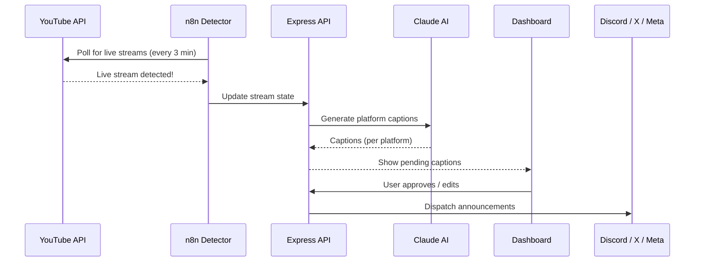

# StreamBoost

StreamBoost automates the entire live stream announcement pipeline — from detecting a YouTube live stream to posting AI-generated, platform-specific announcements across Discord, X (Twitter), Instagram, and Facebook.

## How it works

## Stream lifecycle

| Phase | Event | Actions |
| ----- | ----- | ------- |
| **Detection** | YouTube live detected | Create stream state, generate go-live captions |
| **Live** | Stream ongoing | Monitor viewer count, track peak viewers |
| **Milestone** | Subscriber threshold hit | Generate celebration captions |
| **End** | Stream ends | Generate end-stream CTA captions |

## Platform support

| Platform | Method | Format |
| -------- | ------ | ------ |
| Discord | Webhook | Rich embed or plain text |
| X (Twitter) | OAuth2 API | Tweet with hashtags |
| Instagram | Meta Graph API | Post with image |
| Facebook | Meta Graph API | Page post |

## Caption approval flow

1. AI generates captions tailored to each platform's voice and format
2. Captions appear in the StreamBoost dashboard as **pending**
3. You can:
    - **Approve** — Post as-is
    - **Edit** — Modify the text before posting
    - **Skip** — Don't post to that platform
4. Approved captions are dispatched via the n8n posting pipeline

## Channel voice settings

Each platform has configurable AI tone settings:

| Setting | Options | Description |
| ------- | ------- | ----------- |
| Tone preset | `professional`, `friendly`, `hype`, `mixed` | Base AI personality |
| Custom prompt | Free text | Full prompt override |
| Core hashtags | Array | Always-included hashtags |
| CTA text | Free text | Call-to-action appended to posts |
| Discord format | `embed` / `plain` | Discord-specific formatting |

## Milestone celebrations

StreamBoost tracks subscriber milestones and automatically generates celebration announcements:

| Milestone | Triggered at |
| --------- | ------------ |
| 100 Subscribers | 100 |
| 500 Subscribers | 500 |
| 1K Subscribers | 1,000 |
| 5K Subscribers | 5,000 |
| 10K Subscribers | 10,000 |
| 50K Subscribers | 50,000 |

Custom thresholds can be added via the API.
