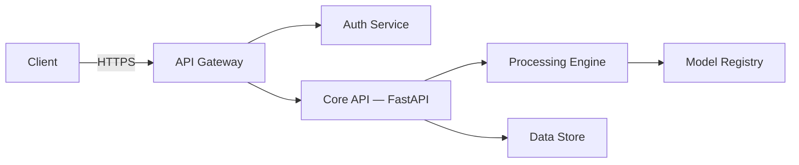

# Architecture

Convergio AI is built as a modular, API-first platform using FastAPI. This page describes the high-level system design.

## High-level overview

## Design principles

| Principle          | Description                                                   |
| ------------------ | ------------------------------------------------------------- |
| **API-first**      | Every capability is exposed through a versioned REST API.     |
| **Modular**        | Services are loosely coupled and independently deployable.    |
| **Observable**     | Structured logging, metrics, and tracing are built in.        |
| **Secure by default** | Authentication required on all endpoints. TLS everywhere. |

## Technology stack

| Layer       | Technology  |
| ----------- | ----------- |
| API         | FastAPI     |
| Runtime     | Python 3.12 |
| Data        | PostgreSQL  |
| Cache       | Redis       |
| Deployment  | Docker      |

!!! info "This page will be expanded"
    Detailed architecture diagrams and component descriptions are coming soon.
