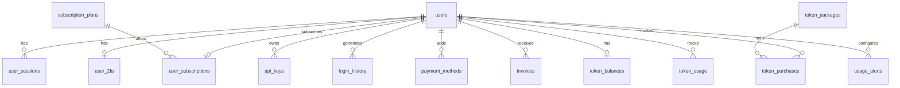

# Database Schema

Convergio AI uses PostgreSQL with four schema files, applied in order during `npm run db:init`.

## Schema files

| File | Tables | Domain |
| ---- | ------ | ------ |
| `schema.sql` | 4 | Core: emails, tasks, auto-replies, audits |
| `schema-settings.sql` | 14 | Auth, billing, tokens |
| `schema-calendar.sql` | 2 | Calendar events, Cal.com |
| `schema-streamboost.sql` | 7 | Streams, announcements, captions |

## Core tables (`schema.sql`)

### emails

| Column | Type | Description |
| ------ | ---- | ----------- |
| `id` | SERIAL PK | |
| `message_id` | VARCHAR(500) UNIQUE | Email message ID (deduplication) |
| `from_address` | VARCHAR(255) | Sender email |
| `from_name` | VARCHAR(255) | Sender display name |
| `to_address` | VARCHAR(255) | Recipient email |
| `subject` | TEXT | Email subject line |
| `body_text` | TEXT | Plain text body |
| `body_html` | TEXT | HTML body |
| `tag` | VARCHAR(50) | Auto-derived category |
| `direction` | VARCHAR(20) | `inbound` or `outbound` |
| `attachments` | JSONB | Attachment metadata |
| `received_at` | TIMESTAMPTZ | When the email was received |

### tasks

| Column | Type | Description |
| ------ | ---- | ----------- |
| `id` | SERIAL PK | |
| `email_id` | INTEGER FK | Link to source email |
| `title` | VARCHAR(500) | Task title |
| `description` | TEXT | Task details |
| `status` | VARCHAR(50) | `todo`, `in_progress`, `done` |
| `priority` | VARCHAR(20) | `low`, `medium`, `high`, `urgent` |
| `completed_at` | TIMESTAMPTZ | Completion timestamp |

### digital_audits

| Column | Type | Description |
| ------ | ---- | ----------- |
| `id` | SERIAL PK | |
| `website_url` | VARCHAR(500) | Target website |
| `status` | VARCHAR(50) | Audit status |
| `overall_score` | INTEGER | Aggregate score |
| `audit_results` | JSONB | Detailed results |
| `business_details` | JSONB | Business context |

## Auth & billing tables (`schema-settings.sql`)

### users

Core user table with email, password hash, profile fields, timezone, and notification preferences.

### Related tables

### Subscription plans (seeded)

| Plan | Slug | Monthly (INR) | Token limit |
| ---- | ---- | ------------- | ----------- |
| Free | `free` | 0 | 1,000 |
| Pro | `pro` | 1,999 | 50,000 |
| Enterprise | `enterprise` | 9,999 | 500,000 |

## Calendar tables (`schema-calendar.sql`)

### calendar_events

Full-featured calendar event model with:

- Cal.com booking ID linkage
- Email-to-event association
- Attendees as JSONB array
- Source tracking (`manual`, `calcom`, `email_detected`)
- Detection confidence score (for AI-detected meetings)

## StreamBoost tables (`schema-streamboost.sql`)

### stream_state

Tracks YouTube live streams with video ID, status, viewer count, peak viewers, and raw API data.

### stream_announcements

Records cross-platform announcement delivery with retry support:

| Column | Type | Description |
| ------ | ---- | ----------- |
| `platform` | VARCHAR(50) | `discord`, `x`, `instagram`, `facebook` |
| `announcement_type` | VARCHAR(50) | `go_live`, `end_stream`, `milestone` |
| `status` | VARCHAR(20) | `pending`, `sent`, `failed` |
| `retry_count` | INTEGER | Delivery attempt count |

### platform_credentials

Stores platform connection details (YouTube API key, Discord webhook, X OAuth2, Meta token).

### channel_voice_settings

Per-platform AI tone configuration:

| Column | Description |
| ------ | ----------- |
| `tone_preset` | `professional`, `friendly`, `hype`, `mixed` |
| `custom_prompt` | User's full prompt override |
| `core_hashtags` | Base hashtags array |
| `cta_text` | Call-to-action text |
| `templates` | Caption template JSONB |

### milestone_thresholds

Subscriber milestone targets (100, 500, 1K, 5K, 10K, 50K) with celebration tracking.
