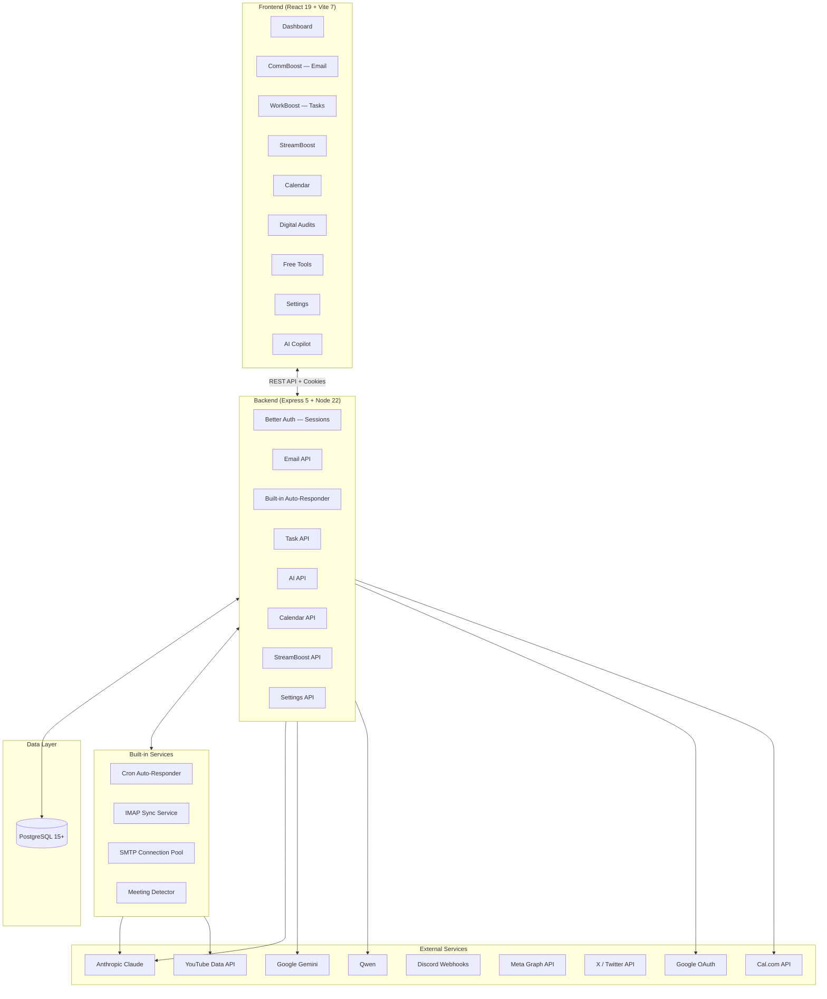
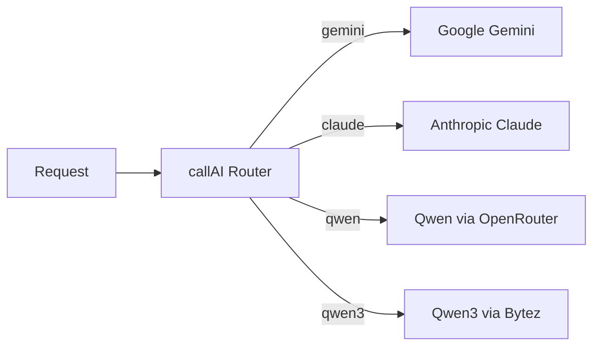
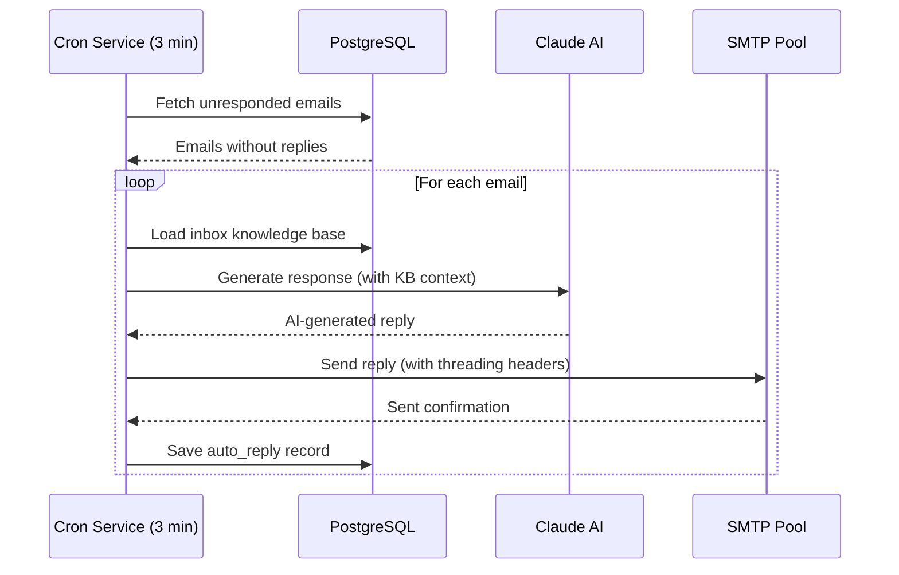
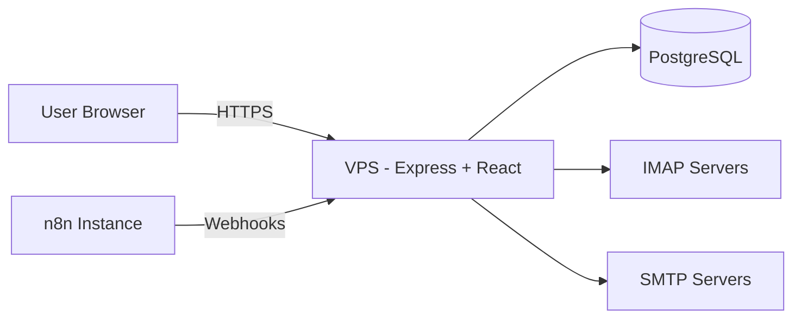

# Architecture

Convergio AI is a full-stack TypeScript application with a React frontend, Express backend, PostgreSQL database, and built-in automation services.

## High-level overview



!!! info "Key change in v3.0"
    The email auto-responder is now **built into the server** as a cron service, eliminating the previous dependency on n8n for core email automation. n8n is still used for advanced workflows like StreamBoost post dispatching.

## Technology stack

=== "Frontend"

    | Technology | Version | Purpose |
    | ---------- | ------- | ------- |
    | React | 19.2 | UI framework |
    | TypeScript | 5.9 | Type safety |
    | Vite | 7.2 | Build tooling and dev server |
    | React Router | 7.13 | Client-side routing |
    | Recharts | 3.7 | Data visualization |
    | TipTap | 3.20 | Rich text editor (email compose) |
    | Tabler | — | Design system foundation |

=== "Backend"

    | Technology | Version | Purpose |
    | ---------- | ------- | ------- |
    | Node.js | 22+ | Runtime |
    | Express | 5.2 | HTTP framework |
    | TypeScript | 5.9 | Type safety (via tsx) |
    | PostgreSQL | 15+ | Primary database |
    | pg | 8.17 | Database driver |
    | Better Auth | 1.5 | Session-based authentication |
    | Nodemailer | 7.0 | Email sending (SMTP) |
    | IMAPFlow | 1.2 | Email synchronization |
    | Node Cron | 4.2 | Scheduled tasks |
    | Sharp | 0.34 | Image processing |
    | Swagger UI | 6.2 | API documentation |

=== "AI & Automation"

    | Technology | Purpose |
    | ---------- | ------- |
    | Anthropic Claude | Primary AI for email replies and content |
    | Google Gemini | Alternative AI model |
    | Qwen (OpenRouter) | Additional model option |
    | n8n | Advanced workflow automation (optional) |
    | Cal.com | Scheduling integration |

## Design patterns

### Multi-model AI adapter

The `callAI()` function routes requests to the active AI provider based on runtime configuration:



Users can switch the active model at runtime via `/api/ai-model` without restarting the server.

### Email tag derivation

Emails are automatically categorized by the recipient address prefix:

| Inbox address                  | Derived tag | Knowledge base       |
| ------------------------------ | ----------- | -------------------- |
| `hello@digitechnomads.com`     | Hello       | Sales / new business |
| `partners@digitechnomads.com`  | Partners    | Partnerships         |
| `info@digitechnomads.com`      | Info        | Press / general      |
| `support@digitechnomads.com`   | Support     | Client support       |
| `neo@digitechnomads.com`       | Neo         | Technical inquiries  |

### Built-in email auto-responder

The auto-responder runs as a cron service every 3 minutes, processing unresponded emails:



Each inbox has its own toggle to enable/disable auto-responses via `POST /api/auto-responder/toggle`.

### Better Auth session management

Authentication uses cookie-based sessions powered by Better Auth:

1. User signs in via email/password or Google OAuth
2. Better Auth creates a session record in the database
3. A secure HTTP-only cookie is set on the response
4. All `/api/*` routes validate the session via `requireSession` middleware
5. Session revocation is instant — deleting the record invalidates access

!!! tip "No JWT tokens"
    v3.0 uses cookie-based sessions exclusively. There are no bearer tokens, refresh tokens, or JWT signing keys.

### Auto-task creation

Every incoming email automatically creates a corresponding task via `saveEmailToDB()`, ensuring nothing falls through the cracks.

## Frontend architecture

```
App.tsx (React Router)
├── Layout.tsx (Sidebar, theme toggle, AI Copilot panel)
├── Pages/
│   ├── Dashboard.tsx — Stats, recent emails, quick actions
│   ├── CommBoost.tsx — Multi-inbox email management
│   ├── WorkBoost.tsx — Kanban board + list view
│   ├── StreamBoost.tsx — Live stream automation
│   ├── Calendar.tsx — Multi-view calendar
│   ├── DigitalAudit.tsx — Audit workflows
│   ├── FreeTools.tsx — AI Prompt Generator
│   ├── ContentBoost.tsx — Content creation (coming soon)
│   ├── IdeaBoost.tsx — Idea management (coming soon)
│   ├── CampaignBoost.tsx — Campaign tools (coming soon)
│   └── Settings.tsx — Profile, security, billing, API keys
├── Components/ — Reusable UI components
├── Context/AuthContext.tsx — Better Auth state management
└── Lib/auth-client.ts — Better Auth client library
```

## Backend architecture

```
server/
├── index.ts — Express app + all API endpoint definitions
├── auth.ts — Better Auth configuration (email, Google OAuth, org plugin)
├── middleware/session.ts — requireSession middleware
├── services/
│   ├── emailAutoResponder.ts — Cron-based auto-reply service
│   ├── emailSync.ts — IMAP sync from all configured inboxes
│   ├── emailResponseGenerator.ts — Claude AI response generation
│   ├── calcom.ts — Cal.com calendar integration
│   └── meetingDetector.ts — AI meeting detection from emails
├── routes/
│   ├── calendar.ts — Calendar CRUD endpoints
│   └── settings.ts — Settings management endpoints
├── utils/ — Helper functions
├── smtp/ — SMTP connection pooling
└── swagger.ts — OpenAPI documentation config
```

## Deployment architecture



| Component | Platform |
| --------- | -------- |
| Application | VPS with PM2 (frontend + backend) |
| Database  | PostgreSQL 15+ (local or remote) |
| Workflows | Self-hosted n8n (optional) |

## Related pages

- [Core Concepts](concepts.md) — Domain model and key abstractions
- [Database Schema](database.md) — PostgreSQL tables and relationships
- [API Reference](../../api/index.md) — REST API endpoints
