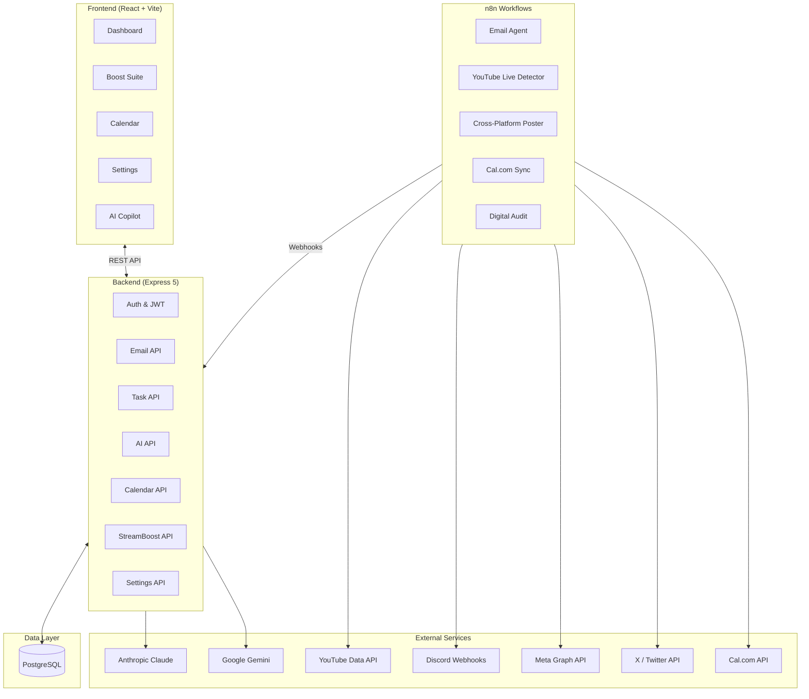
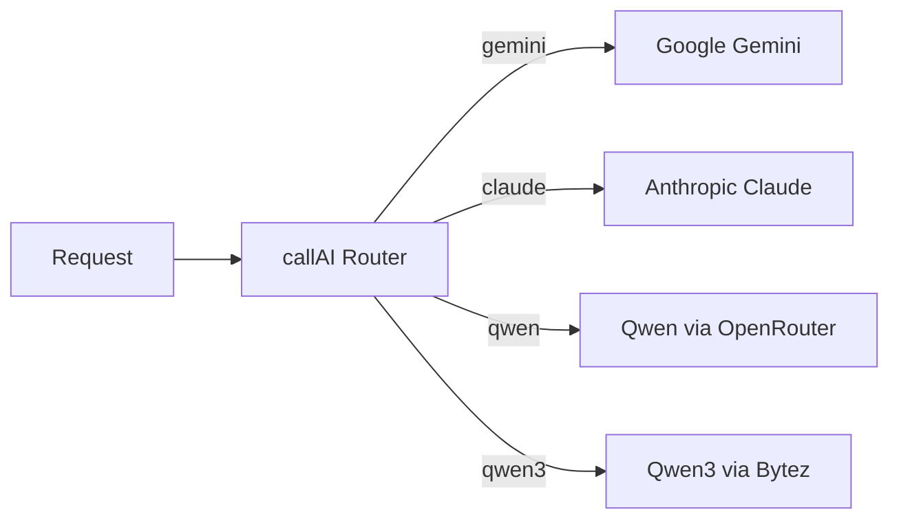
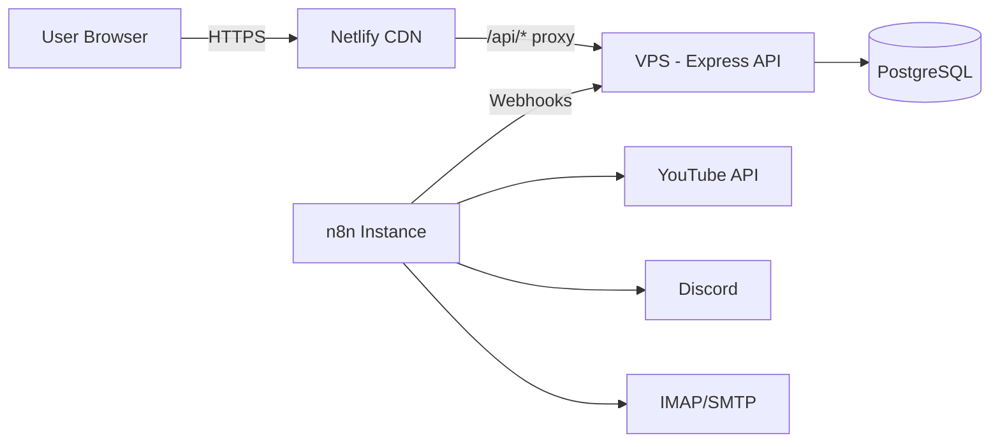

# Architecture

Convergio AI is a full-stack TypeScript application with a React frontend, Express backend, PostgreSQL database, and n8n workflow automation.

## High-level overview

## Technology stack

=== "Frontend"

    | Technology | Version | Purpose |
    | ---------- | ------- | ------- |
    | React | 19.2 | UI framework |
    | TypeScript | 5.9 | Type safety |
    | Vite | 7.2 | Build tooling and dev server |
    | React Router | 7.13 | Client-side routing |
    | Recharts | 3.7 | Data visualization |
    | TipTap | 3.20 | Rich text editor (email compose) |
    | Tabler | — | Design system foundation |

=== "Backend"

    | Technology | Version | Purpose |
    | ---------- | ------- | ------- |
    | Node.js | 20+ | Runtime |
    | Express | 5.2 | HTTP framework |
    | TypeScript | 5.9 | Type safety (via tsx) |
    | PostgreSQL | 15+ | Primary database |
    | pg | 8.17 | Database driver |
    | JWT | — | Authentication |
    | bcrypt | 6.0 | Password hashing |
    | Swagger UI | 5.0 | API documentation |
    | Sharp | 0.34 | Image processing |
    | IMAPFlow | 1.2 | Email synchronization |

=== "AI & Automation"

    | Technology | Purpose |
    | ---------- | ------- |
    | Anthropic Claude | Primary AI for email replies and content |
    | Google Gemini | Alternative AI model |
    | Qwen (OpenRouter) | Additional model option |
    | n8n | Workflow automation engine |
    | Cal.com | Scheduling integration |

## Design patterns

### Multi-model AI adapter

The `callAI()` function routes requests to the active AI provider based on runtime configuration:

Users can switch the active model at runtime via `/api/ai-model` without restarting the server.

### Email tag derivation

Emails are automatically categorized by the recipient address prefix:

| Inbox address                  | Derived tag | Knowledge base       |
| ------------------------------ | ----------- | -------------------- |
| `hello@digitechnomads.com`     | Hello       | Sales / new business |
| `partners@digitechnomads.com`  | Partners    | Partnerships         |
| `info@digitechnomads.com`      | Info        | Press / general      |
| `support@digitechnomads.com`   | Support     | Client support       |
| `neo@digitechnomads.com`       | Neo         | Technical inquiries  |

### Auto-task creation

Every incoming email automatically creates a corresponding task via `saveEmailToDB()`, ensuring nothing falls through the cracks.

### JWT + database sessions

Authentication uses a double-check pattern:

1. JWT token must be valid (signature + expiry)
2. Session record must exist and be active in the database

This allows instant session revocation without waiting for JWT expiry.

## Deployment architecture

| Component | Platform |
| --------- | -------- |
| Frontend  | Netlify  |
| Backend   | VPS with PM2 |
| Database  | PostgreSQL (remote) |
| Workflows | Self-hosted n8n |

## Related pages

- [Core Concepts](concepts.md) — Domain model and key abstractions
- [Database Schema](database.md) — PostgreSQL tables and relationships
- [API Reference](../../api/index.md) — REST API endpoints
