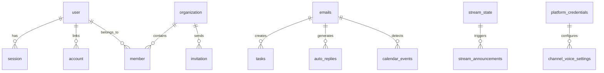

# Database Schema

Convergio AI uses PostgreSQL with six schema files, applied during `node run-schema.js`.

## Schema files

| File | Domain |
| ---- | ------ |
| `schema.sql` | Core: emails, tasks, auto-replies, audits, app settings |
| `schema-better-auth.sql` | Authentication: users, sessions, accounts, organizations |
| `schema-settings.sql` | User settings, API keys, email signatures |
| `schema-calendar.sql` | Calendar events |
| `schema-streamboost.sql` | Streams, announcements, credentials, milestones |
| `schema-threading.sql` | Email threading (Message-ID, In-Reply-To, References) |

## Entity relationship diagram

## Better Auth tables (`schema-better-auth.sql`)

!!! info "New in v3.0"
    These tables replace the previous JWT-based auth system. Better Auth manages sessions, OAuth accounts, and organizations.

### user

| Column | Type | Description |
| ------ | ---- | ----------- |
| `id` | VARCHAR PK | Unique user identifier |
| `name` | VARCHAR(255) | Display name |
| `email` | VARCHAR(255) UNIQUE | Email address |
| `emailVerified` | BOOLEAN | Email verification status |
| `image` | TEXT | Profile image URL |
| `createdAt` | TIMESTAMPTZ | Account creation time |
| `updatedAt` | TIMESTAMPTZ | Last update time |

### session

| Column | Type | Description |
| ------ | ---- | ----------- |
| `id` | VARCHAR PK | Session identifier |
| `userId` | VARCHAR FK | Reference to user |
| `token` | VARCHAR UNIQUE | Session token (stored in cookie) |
| `expiresAt` | TIMESTAMPTZ | Session expiration |
| `ipAddress` | VARCHAR(45) | Client IP address |
| `userAgent` | TEXT | Client user agent |

### account

| Column | Type | Description |
| ------ | ---- | ----------- |
| `id` | VARCHAR PK | Account identifier |
| `userId` | VARCHAR FK | Reference to user |
| `providerId` | VARCHAR | Auth provider (`credential`, `google`) |
| `accountId` | VARCHAR | Provider-specific account ID |
| `password` | TEXT | Hashed password (credential provider only) |

### organization

| Column | Type | Description |
| ------ | ---- | ----------- |
| `id` | VARCHAR PK | Organization identifier |
| `name` | VARCHAR(255) | Organization name |
| `slug` | VARCHAR UNIQUE | URL-safe identifier |
| `createdAt` | TIMESTAMPTZ | Creation time |

### member

| Column | Type | Description |
| ------ | ---- | ----------- |
| `id` | VARCHAR PK | Membership identifier |
| `userId` | VARCHAR FK | Reference to user |
| `organizationId` | VARCHAR FK | Reference to organization |
| `role` | VARCHAR(50) | `owner`, `admin`, `member` |

### invitation

| Column | Type | Description |
| ------ | ---- | ----------- |
| `id` | VARCHAR PK | Invitation identifier |
| `email` | VARCHAR(255) | Invited email address |
| `organizationId` | VARCHAR FK | Target organization |
| `role` | VARCHAR(50) | Assigned role on acceptance |
| `status` | VARCHAR(20) | `pending`, `accepted`, `rejected` |

## Core tables (`schema.sql`)

### emails

| Column | Type | Description |
| ------ | ---- | ----------- |
| `id` | SERIAL PK | |
| `message_id` | VARCHAR(500) UNIQUE | RFC 2822 Message-ID (deduplication) |
| `from_address` | VARCHAR(255) | Sender email |
| `from_name` | VARCHAR(255) | Sender display name |
| `to_address` | VARCHAR(255) | Recipient email |
| `subject` | TEXT | Email subject line |
| `body_text` | TEXT | Plain text body |
| `body_html` | TEXT | HTML body |
| `tag` | VARCHAR(50) | Auto-derived category (Hello, Partners, etc.) |
| `direction` | VARCHAR(20) | `inbound` or `outbound` |
| `attachments` | JSONB | Attachment metadata |
| `in_reply_to` | VARCHAR(500) | Parent email Message-ID |
| `references` | TEXT | Full thread reference chain |
| `received_at` | TIMESTAMPTZ | When the email was received |

### tasks

| Column | Type | Description |
| ------ | ---- | ----------- |
| `id` | SERIAL PK | |
| `email_id` | INTEGER FK | Link to source email |
| `title` | VARCHAR(500) | Task title |
| `description` | TEXT | Task details |
| `status` | VARCHAR(50) | `pending`, `in_progress`, `completed` |
| `priority` | VARCHAR(20) | `low`, `medium`, `high` |
| `source` | VARCHAR(50) | Module origin (CommBoost, Manual, etc.) |
| `completed_at` | TIMESTAMPTZ | Completion timestamp |

### auto_replies

| Column | Type | Description |
| ------ | ---- | ----------- |
| `id` | SERIAL PK | |
| `email_id` | INTEGER FK | Source email reference |
| `reply_text` | TEXT | Generated reply content |
| `ai_model` | VARCHAR(50) | Model used for generation |
| `sent_at` | TIMESTAMPTZ | When the reply was sent |

### digital_audits

| Column | Type | Description |
| ------ | ---- | ----------- |
| `id` | SERIAL PK | |
| `website_url` | VARCHAR(500) | Target website |
| `status` | VARCHAR(50) | `pending`, `processing`, `completed`, `failed` |
| `overall_score` | INTEGER | Aggregate score |
| `audit_results` | JSONB | Detailed results (SEO, performance, security, etc.) |

### app_settings

| Column | Type | Description |
| ------ | ---- | ----------- |
| `key` | VARCHAR PK | Setting name |
| `value` | TEXT | Setting value |

Stores global configuration like the active AI model and last sync timestamps.

## Settings tables (`schema-settings.sql`)

### api_keys

| Column | Type | Description |
| ------ | ---- | ----------- |
| `id` | SERIAL PK | |
| `user_id` | VARCHAR FK | Owner reference |
| `key_hash` | VARCHAR | Hashed API key (stored securely) |
| `key_prefix` | VARCHAR(10) | Visible prefix (`cai_...`) |
| `name` | VARCHAR(255) | Key label |
| `last_used_at` | TIMESTAMPTZ | Last usage time |
| `created_at` | TIMESTAMPTZ | Creation time |

### email_signatures

| Column | Type | Description |
| ------ | ---- | ----------- |
| `id` | SERIAL PK | |
| `user_id` | VARCHAR FK | Owner reference |
| `name` | VARCHAR(255) | Signature label |
| `content` | TEXT | HTML signature content |
| `is_default` | BOOLEAN | Default signature flag |

## Calendar tables (`schema-calendar.sql`)

### calendar_events

| Column | Type | Description |
| ------ | ---- | ----------- |
| `id` | SERIAL PK | |
| `title` | VARCHAR(500) | Event title |
| `description` | TEXT | Event details |
| `start_time` | TIMESTAMPTZ | Event start |
| `end_time` | TIMESTAMPTZ | Event end |
| `all_day` | BOOLEAN | All-day event flag |
| `status` | VARCHAR(20) | `confirmed`, `tentative`, `cancelled` |
| `source` | VARCHAR(50) | `manual`, `calcom`, `email_detected` |
| `calcom_booking_id` | VARCHAR | Cal.com booking reference |
| `email_id` | INTEGER FK | Source email (for detected meetings) |
| `meeting_url` | TEXT | Video call URL |
| `attendees` | JSONB | Attendee list |
| `detection_confidence` | DECIMAL | AI confidence score (0-1) |

## StreamBoost tables (`schema-streamboost.sql`)

### stream_state

Tracks YouTube live streams with video ID, status (`live`, `ended`), viewer count, peak viewers, subscriber count, and raw API data.

### stream_announcements

| Column | Type | Description |
| ------ | ---- | ----------- |
| `id` | SERIAL PK | |
| `platform` | VARCHAR(50) | `discord`, `x`, `instagram`, `facebook` |
| `announcement_type` | VARCHAR(50) | `go_live`, `end_stream`, `milestone` |
| `content` | TEXT | Announcement content |
| `status` | VARCHAR(20) | `pending`, `sent`, `failed` |
| `retry_count` | INTEGER | Delivery attempt count |

### platform_credentials

Stores platform connection details per platform (YouTube API key, Discord webhook URL, X OAuth2 tokens, Meta system user token).

### channel_voice_settings

| Column | Description |
| ------ | ----------- |
| `platform` | Target platform |
| `tone_preset` | `professional`, `friendly`, `hype`, `mixed` |
| `custom_prompt` | Full prompt override |
| `core_hashtags` | Base hashtags array |
| `cta_text` | Call-to-action text |
| `templates` | Caption template JSONB |

### milestone_thresholds

Subscriber milestone targets (100, 500, 1K, 5K, 10K, 50K) with celebration tracking and trigger history.

## Related pages

- [Architecture](architecture.md) — System design and service topology
- [Core Concepts](concepts.md) — Domain model and key abstractions
- [API Reference](../../api/index.md) — REST API endpoints
