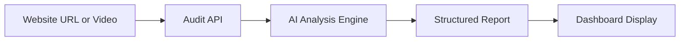

# Digital Audits

Convergio AI includes an AI-powered audit system for analyzing websites across multiple dimensions — security, performance, SEO, social media presence, and brand consistency.

## How it works



1. Enter a website URL or upload a video file for analysis
2. The AI analysis engine evaluates the site across multiple categories
3. Results are generated as a structured report with scores and recommendations
4. Reports are saved to the database and displayed in the dashboard

## Audit dimensions

| Dimension | What's analyzed |
| --------- | --------------- |
| **SEO** | Meta tags, heading structure, content quality, keyword usage, sitemap |
| **Performance** | Page load speed, Core Web Vitals indicators, resource optimization |
| **Social media** | Cross-platform presence, posting frequency, engagement indicators |
| **Brand consistency** | Visual identity, messaging coherence, cross-channel alignment |
| **Security** | SSL configuration, security headers, vulnerability indicators |

## Audit types

| Type | Input | Description |
| ---- | ----- | ----------- |
| **Digital Audit** | Website URL | Comprehensive analysis across all dimensions |
| **Security Audit** | Website URL | Focused security assessment |
| **Video Audit** | Video file upload | Analysis of video content |

## Results

Each audit produces:

- **Overall score** — Aggregate assessment (0-100)
- **Executive summary** — AI-generated overview of findings
- **Category scores** — Individual scores for each dimension
- **Priority recommendations** — Actionable improvements ranked by impact and effort
- **Impact/effort ratings** — Each recommendation includes estimated impact (high/medium/low) and effort to implement

Results are stored as JSONB for flexible querying and rich reporting.

## Audit lifecycle

```
pending → processing → completed
                    → failed
```

| Status | Description |
| ------ | ----------- |
| `pending` | Audit created, waiting for processing |
| `processing` | AI analysis in progress |
| `completed` | Results available in the dashboard |
| `failed` | Analysis could not be completed |

## Dashboard

The Digital Audit page provides:

- **New audit form** — Enter a URL or upload a video to start an analysis
- **Audit history** — Browse past audits with status indicators
- **Report view** — Detailed results with scores, recommendations, and executive summary
- **Security audit section** — Dedicated view for security-focused assessments

## API

| Method | Endpoint | Description |
| ------ | -------- | ----------- |
| `POST` | `/api/audits` | Create new digital audit |
| `GET` | `/api/audits` | List all digital audits |
| `POST` | `/api/audits/:id/complete` | Complete audit with results |
| `POST` | `/api/security-audits` | Create security audit |
| `GET` | `/api/security-audits` | List security audits |
| `DELETE` | `/api/security-audits/:id` | Delete security audit |

## Related pages

- [AI Copilot](../ai-copilot/overview.md) — AI-powered analysis interface
- [Best Practices](../best-practices/best-practices.md) — Security recommendations
