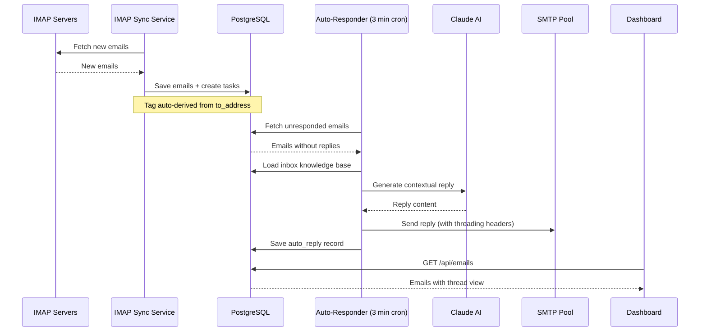

# CommBoost — Email Management

CommBoost is Convergio AI's intelligent email management system. It connects to five IMAP inboxes, automatically categorizes incoming emails, generates AI-powered responses through a built-in auto-responder, and provides a full-featured email client in the dashboard.

## How it works

!!! info "Built-in automation"
    The auto-responder runs directly within the Express server as a cron job every 3 minutes. No external workflow engine is required for core email automation.

## Multi-inbox system

Each inbox maps to a tag, color, and its own AI knowledge base:

| Inbox | Email | Tag | Color | Purpose | Knowledge Base |
| ----- | ----- | --- | ----- | ------- | -------------- |
| Hello | hello@digitechnomads.com | Hello | :material-circle:{ style="color: #3b82f6" } Blue | Sales and new business | general.md, hello.md |
| Partners | partners@digitechnomads.com | Partners | :material-circle:{ style="color: #c084fc" } Purple | Partnership requests | general.md, partners.md |
| Info | info@digitechnomads.com | Info | :material-circle:{ style="color: #22d3ee" } Cyan | Press and media | general.md, info.md |
| Support | support@digitechnomads.com | Support | :material-circle:{ style="color: #fb923c" } Orange | Client support | general.md, support.md |
| Neo | neo@digitechnomads.com | Neo | :material-circle:{ style="color: #10b981" } Green | Special projects | general.md, agent-prompts.md |

## Features

### Email management

- **Auto-categorization** — Emails are tagged automatically based on the recipient address prefix
- **Thread view** — Related emails are grouped into conversations using RFC 2822 Message-ID, In-Reply-To, and References headers
- **Thread count badges** — See at a glance how many messages are in each conversation
- **SafeEmailBody** — Emails are rendered in a sandboxed iframe with image blocking for security
- **Compose and reply** — Rich text editor (TipTap) for composing and replying directly from the dashboard
- **Attachment uploads** — Upload and send file attachments with emails
- **IMAP sync** — On-demand synchronization across all configured inboxes via `POST /api/sync`
- **Deduplication** — Unique `message_id` constraint prevents duplicate email storage

### AI auto-responder

The built-in auto-responder processes unresponded emails every 3 minutes:

- **Per-inbox toggle** — Enable or disable auto-responses for each inbox independently
- **Knowledge base context** — Each inbox loads its specific knowledge base files for contextual responses
- **Claude AI generation** — Responses are generated using the active AI model with anti-injection prompts
- **SMTP connection pooling** — Replies are sent through a pooled SMTP connection for reliability
- **Threading headers** — All replies include proper Message-ID, In-Reply-To, and References headers

!!! tip "Toggle auto-responses"
    Use `POST /api/auto-responder/toggle` to enable/disable the auto-responder for specific inboxes. Check status with `GET /api/auto-responder/status`.

### Email intelligence

- **AI analysis** — `GET /api/ai/email-intelligence` provides insights on email content, urgency, and action items
- **Draft generation** — `POST /api/ai/email-draft` generates reply drafts using the inbox knowledge base
- **Multi-model support** — Switch between Claude, Gemini, and Qwen for different response quality/speed tradeoffs

## Dashboard views

- **Unified inbox** — All emails across all inboxes in one view
- **Per-inbox view** — Filter by specific inbox tag
- **Tag filtering** — Filter by auto-derived tags
- **Thread view** — Click an email to see the full conversation thread
- **Email detail modal** — View the complete email with safe HTML rendering

### Read/unread tracking

- **Per-email read status** — Emails are tracked as read or unread with the `is_read` column
- **Bulk mark read/unread** — Select multiple emails and mark them read or unread in one action via `PATCH /api/emails/read`
- **Filter by status** — Filter the inbox view by Read, Unread, or All
- **Auto-mark on open** — Opening an email detail view automatically marks it as read

## Inbox management

Since v3.3.0, inboxes are managed through the **Settings > Email Inboxes** UI instead of environment variables. Credentials are encrypted at rest using AES-256-GCM.

### Adding an inbox

1. Go to **Settings > Email Inboxes**
2. Click **Add Inbox**
3. Fill in the inbox details:
    - **Name** — Display name (e.g., "Hello")
    - **Email address** — Full email address
    - **Tag** — Unique tag for categorization (must not be "General")
    - **IMAP settings** — Host, port (default: 993), username, password
    - **SMTP settings** — Host, port (default: 465), username, password
4. Click **Test Connection** to verify both IMAP and SMTP
5. Save the inbox

### Connection testing

Use `POST /api/inboxes/:id/test` to verify IMAP and SMTP connectivity. Returns success/failure for each protocol independently.

### Security

- Passwords are encrypted with **AES-256-GCM** using a key derived from `BETTER_AUTH_SECRET` via PBKDF2 (100,000 iterations)
- Passwords are never returned in API responses
- The last active inbox cannot be deleted

!!! warning "Credential encryption key"
    The `BETTER_AUTH_SECRET` environment variable is used to derive the encryption key. Changing this value will make existing stored credentials unreadable. You would need to re-add all inboxes.

## Related pages

- [AI Copilot](../ai-copilot/overview.md) — Chat interface for email summaries
- [Email API](../../api/emails.md) — REST endpoints for email operations
- [Configuration](../getting-started/configuration.md) — IMAP/SMTP settings
