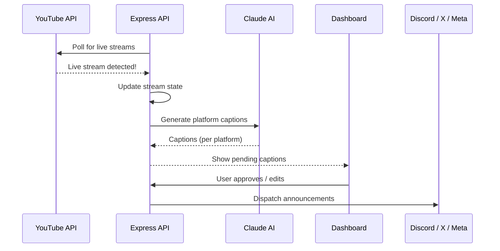

# StreamBoost

StreamBoost automates the entire live stream announcement pipeline — from detecting a YouTube live stream to posting AI-generated, platform-specific announcements across Discord, X (Twitter), Instagram, and Facebook. It also tracks subscriber milestones and generates shareable graphics.

## How it works



## Stream lifecycle

| Phase | Event | Actions |
| ----- | ----- | ------- |
| **Detection** | YouTube live detected | Create stream state, generate go-live captions |
| **Live** | Stream ongoing | Monitor viewer count, track peak viewers, check milestones |
| **Milestone** | Subscriber threshold hit | Generate celebration captions and milestone cards |
| **End** | Stream ends | Generate end-stream CTA captions |

## Platform support

| Platform | Method | Format |
| -------- | ------ | ------ |
| YouTube | Data API v3 | Live stream detection and metadata |
| Discord | Webhook | Rich embed or plain text announcements |
| X (Twitter) | OAuth2 API | Tweet with hashtags |
| Instagram | Meta Graph API | Post with image |
| Facebook | Meta Graph API | Page post |

## Caption approval flow

1. AI generates captions tailored to each platform's voice and format
2. Captions appear in the StreamBoost dashboard as **pending**
3. For each caption, you can:
    - **Approve** — Post as-is
    - **Edit** — Modify the text before posting
    - **Skip** — Don't post to that platform
    - **Upload image** — Add or change the thumbnail per platform
4. Approved captions are dispatched to their respective platforms

!!! tip "Bulk actions"
    Use `POST /api/streamboost/post/all` to dispatch all approved captions at once, or `POST /api/streamboost/post/:captionId` to post individually.

## Channel voice settings

Each platform has configurable AI tone settings that shape how captions are generated:

| Setting | Options | Description |
| ------- | ------- | ----------- |
| Tone preset | `professional`, `friendly`, `hype`, `mixed` | Base AI personality |
| Custom prompt | Free text | Full prompt override |
| Core hashtags | Array | Always-included hashtags |
| CTA text | Free text | Call-to-action appended to posts |

Manage voice settings via `PUT /api/streamboost/channels/:platform`.

## Milestone celebrations

StreamBoost tracks subscriber milestones and automatically generates celebration announcements:

| Milestone | Threshold |
| --------- | --------- |
| 100 Subscribers | 100 |
| 500 Subscribers | 500 |
| 1K Subscribers | 1,000 |
| 5K Subscribers | 5,000 |
| 10K Subscribers | 10,000 |
| 50K Subscribers | 50,000 |

Custom thresholds can be added via `POST /api/streamboost/milestones`.

When a milestone is detected:

1. Automatic detection compares current subscriber count against thresholds
2. A celebration event is triggered
3. AI generates milestone-specific captions for all platforms
4. Captions enter the approval workflow

## Story and milestone cards

StreamBoost can generate shareable graphics for social media:

- **Story cards** — Instagram Stories-sized graphics with stream metadata (`POST /api/streamboost/story-card`)
- **Milestone cards** — Custom celebration graphics with subscriber count and branding (`POST /api/streamboost/milestone-card`)

These can be uploaded as images alongside platform captions for richer announcements.

## Announcement system

StreamBoost manages three types of announcements:

| Type | Trigger | Content |
| ---- | ------- | ------- |
| **Go-live** | Stream starts | "We're live!" announcement with stream link |
| **End-stream** | Stream ends | CTA-focused wrap-up with replay link |
| **Milestone** | Subscriber threshold | Celebration post with milestone count |

Each announcement tracks delivery status (`pending`, `sent`, `failed`) with retry support.

## Platform credentials

Manage platform connections via the StreamBoost settings or API:

```bash
# Check connection status
curl http://localhost:3001/api/streamboost/credentials -b cookies.txt

# Update credentials for a platform
curl -X PUT http://localhost:3001/api/streamboost/credentials/discord \
  -H "Content-Type: application/json" \
  -b cookies.txt \
  -d '{"credential_value": "https://discord.com/api/webhooks/..."}'

# Test connectivity
curl -X POST http://localhost:3001/api/streamboost/credentials/discord/test \
  -b cookies.txt
```

## Real-time monitoring

The dashboard sidebar displays a live badge when a stream is active. The StreamBoost page shows:

- Current stream status (live/ended)
- Real-time viewer count
- Peak viewer count
- Subscriber count
- Video ID and stream metadata

Status is polled every 30 seconds while on the StreamBoost page.

## Related pages

- [StreamBoost API](../../api/streamboost.md) — Full API endpoint reference
- [Platform Connections](../../integrations/platforms.md) — Configure social platforms
- [Configuration](../getting-started/configuration.md) — YouTube API setup
